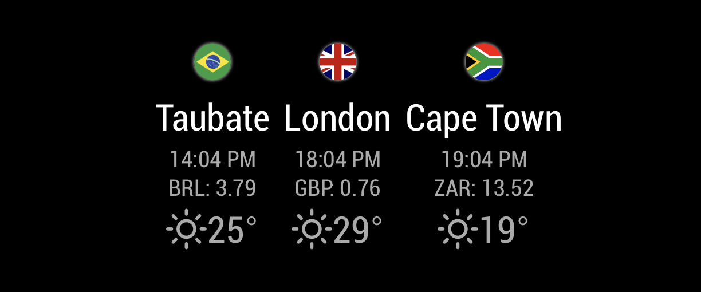

# MMM-PlaceInfo

This an extension for the [MagicMirror²](https://github.com/MagicMirrorOrg/MagicMirror).

This module pulls country/place information to provide a consolidated view
of remote locations. At the moment, local weather, exchange rate and local time
are supported.

The weather data comes from openweather (requires API key).

The currency exchange information comes from http://fixer.io (requires API key).

## Example



## Installation

Open a terminal session, navigate to your MagicMirror's `modules` directory and execute `git clone https://github.com/njwilliams/MMM-PlaceInfo`, a new directory called MMM-PlaceInfo will be created.

Activate the module by adding it to the config.js file as shown below.

## Update

To update the module, navigate to the MMM-PlaceInfo directory and execute `git pull` to pull the latest changes from the repository.

## Configuration

### Example configuration

```javascript
    {
      module: 'MMM-PlaceInfo',
      position: 'bottom-center',
      config: {
        weatherAPIKey: "xxxxxx Copy from currentweather xxxxxx",
        currencyAPIKey: "xxxxx Get an API key xxxxxx",
        currencyPrecision: 2,
        currencyRelativeTo: 'USD',

        places: [
          {
              title: "London",
              flag: "gb",
              currency: "GBP",
              timezone: "Europe/London",
              lat: 51.5085,
              lon: -0.1257,
          },
          {
              title: "Sao Paolo",
              flag: "br",
              currency: "BRL",
              timezone: "America/Sao_Paulo",
              lat: -23.5475,
              lon: -46.6361
          }
        ]
     }
    },
```

### Configuration options

The following properties can be configured:

| **Option** | **Values** | **Description** |
| ---------- | ---------- | --------------- |
| showFlag   | true       | If a flag icon should be part of each place info |
| showText   | true       | If the name of each location should be shown (the flag might be enough)|
| weatherAPIKey | "" | Should be set to an API key for openweathermap.org |
| weatherInterval | 3600000 | How often to update the weather (by default, hourly) |
| currencyAPIKey | "" | Should be set to an API key for fixer.io |
| currencyReversed | false | If you like the currency expressed as remote units or local (i.e. 1/x of the value) |
| currencyRelativeTo | EUR | What you would like to see the currency converted against |
| currencyInterval | 1440000 | How often to update the exchange rates (by default, every 4 hours) |
| currencyPrecision | 3 | How many decimal places to show exchange rates |
| places | list | A list of places to show info |

Each place should have the following attributes:

| **Attribute** | **Description** |
| ---------- | --------------- |
|title|The name of the location, shown if showText is true|
|timezone|The timezone of the location, will affect the clock time shown for each place|
|flag|Two letter code for the country|
|currency|Three letter code for the currency (see fixer.io)|
|lat|The latitude of the place (decimal degrees), used to look up the weather from openweathermap.org|
|lon|The longitude of the place (decimal degrees), used to look up the weather from openweathermap.org|

